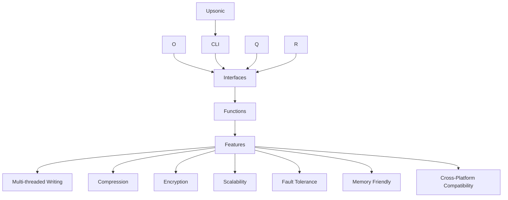

# Upsonic | [](https://github.com/Upsonic/Upsonic/actions/workflows/tests.yml) | [](https://codecov.io/gh/Upsonic/Upsonic) | [](https://github.com/Upsonic/Upsonic/actions/workflows/after_deploy_test.yml)

The Upsonic is a Flexible, secure and scalable database and your python cloud that supports multiple data formats. It comes with built-in features for compressing and encrypting data, and is compatible with all operating systems. With easy-to-use commands, the Upsonic is an excellent choice for developers seeking an efficient and reliable storage solution for their data.

[Website](https://upsonic.co/) | [Discord](https://discord.gg/) | [Twitter](https://twitter.com/upsonicco)


## Installation
You can install Upsonic by pip3:

```console
pip3 install upsonic
```


## 🎉 Upsonic Cloud is published ! | [](https://github.com/Upsonic/Upsonic/actions/workflows/cloud_test.yml) | [Go to Docs](https://Upsonic.github.io/Upsonic/upsonic_cloud.html)
Upsonic Cloud: the ultimate, free cloud database for all Python developers. Experience reliability, efficiency, and top-notch security in one powerful solution. Start your seamless development journey with Upsonic Cloud today!

- "Save your Python Things to the Cloud: Code Unrestricted, Scale Limitless with Upsonic Cloud!"


### Creating Your Free Cloud Key
```console
Upsonic cloud_key
```

### Using Your Cloud | Setting

```python
from upsonic import Upsonic_Cloud
cloud = Upsonic_Cloud("YOUR_CLOUD_KEY")

@cloud.active
def get_address():
    return "Hello World I am from Upsonic Cloud"
```

### Using Your Cloud | Getting

```python
from upsonic import Upsonic_Cloud
cloud = Upsonic_Cloud("YOUR_CLOUD_KEY")


print(cloud.get("get_address")())
```

## Demo

```python
from upsonic import Upsonic

# Creating databases
db = Upsonic("My_New_DB")


# Flexible
db.set("Key", "String")
db.set("Key", 123)
db.set("Key", 123.213)
db.set("Key", Object())
db.set("Key", ["Alist"])
db.set("Key", {"a": "dict"})
db.set("Key", (1,"Atuple"))
db.set("Key", file="onur.jpg")
db.set("Key", file="onur.anytype")


# Secure
db.set("Key", "String",        encryption_key="my_encryption_key")
db.set("Key", 123,             encryption_key="my_encryption_key")
db.set("Key", 123.213,         encryption_key="my_encryption_key")
db.set("Key", Object(),        encryption_key="my_encryption_key")
db.set("Key", ["Alist"],       encryption_key="my_encryption_key")
db.set("Key", {"a": "dict"},   encryption_key="my_encryption_key")
db.set("Key", (1,"Atuple"),    encryption_key="my_encryption_key")
db.set("Key", file="onur.jpg", encryption_key="my_encryption_key")


# Scalable
db.get("Key") #Instant, no waiting and no searching


```

## Features

- **Flexibility**: Save data in any format, including objects and files, providing great flexibility and adaptability to different use cases and data structures.
- **Compressing**: Compress data to minimize storage space while enabling faster data retrieval and processing.
- **Encryption**: Keep sensitive information secure and private with the included encryption feature.
- **Scalability**: Offers stable processing times of set, get, and delete commands, regardless of the dataset's size.
- **Fault Tolerance**: By the design of the Upsonic, it is fully fault-tolerant because each datas are designed to be independent of each other on the disk.
- **Memory Friendly**: The Upsonic is designed to use as little memory as possible. It only loads the data you want to access into memory.
- **Cross-Platform Compatibility**: Compatible with all operating systems, making it easier to integrate into any project.
- **Transactional and Asynchronous Operations**: Perform multiple operations in a single transaction or perform operations asynchronously for improved performance.




## Documentation
You can find the documentation [here](https://Upsonic.github.io/Upsonic/).


## Contributing
Contributions to Upsonic are welcome! If you have any suggestions or find a bug, please open an issue on the GitHub repository. If you want to contribute code, please fork the repository and create a pull request.

## License
Upsonic is released under the MIT License.

<h2 align="center">
    Contributors
</h2>
<p align="center">
    Thank you for your contribution!
</p>
<p align="center">
    <a href="https://github.com/Upsonic/Upsonic/graphs/contributors">
      
    </a>
</p>
<p align="center">
    and <a href="https://sweep.dev/">Sweep !</a>
</p>
